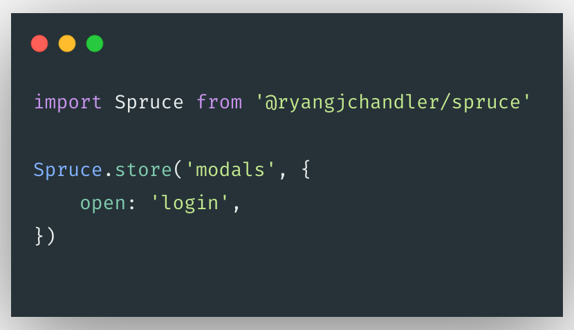

<p align="center">
    
</p>

# 🌲 Spruce

A lightweight state management layer for Alpine.js

## About

Many large frameworks have their own state management solutions. One thing these libraries have in common is a higher level of complexity and a wide range of API interactions. Since Alpine.js is designed to be a simpler and lighter alternative to larger frameworks such as Vue and React, shouldn't the state management solution be as simple, if not simpler, too?

## Installation

### CDN

Include the following `<script>` tag in the `<head>` of your document:

```html
<script src="/path/to/spruce.js">
```

> **Important**: This must be added **before** loading Alpine.js when using CDN links.

### Manual

If you wish to include Spruce with your own bundle:

```bash
yarn add @ryangjchandler/spruce
```

Then add the following to your script:

```javascript
import Spruce from '@ryangjchandler/spruce'
```

## Usage

Spruce exposes less than a handful of possible interaction points. There is an extremely simple "subscriptions" interaction which connects the roots from your Alpine component to the global store, then there is the "stores" interaction which allows you to define scopes of global state for use throughout your components.